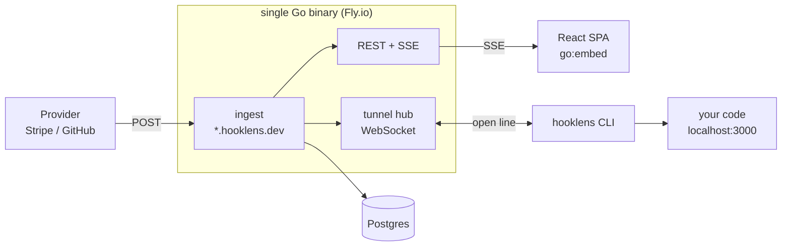

# hooklens — Build Plan

An open-source webhook inspector with a self-hosted tunnel. It gives you a public URL, captures every request sent to it byte-for-byte, streams them live to a web UI, and forwards them down an open connection to code running on your laptop. Replay, diff, and provider-signature verification on top.

Built as a portfolio project to demonstrate the four things a full-stack hire is actually judged on: **a real product with real users, systems depth that survives questioning, a frontend that isn't a CRUD form, and evidence you design for failure.**

> **The story (for the README and interviews):** webhooks are impossible to develop against — you can't see what was sent, and the sender can't reach your laptop. hooklens fixes both. I built the tunnel from scratch, and here are the nine failure modes it handles and the tests that prove it.

**Name:** `hooklens` (check `hooklens.dev` availability). Alternates: `hookline`, `hookbay`, `hookdeck` is taken.

**Budget:** 21 days at 20+ hrs/week ≈ 60–70 hours.

---

## Scope

**In (v1):**

- Public capture endpoint on a wildcard subdomain — accepts any method, any path, any body
- Live request list + inspector UI (JSON tree, headers, raw)
- Reverse tunnel: CLI forwards captured requests to `localhost:PORT`
- Replay, edit-and-replay
- Structural diff between any two requests
- Signature verification for Stripe, GitHub, Slack, Shopify
- Self-host as a single binary or one `docker run`

**Explicitly out (resist these):**

- User accounts, passwords, OAuth — capability URLs are enough and are a defensible design choice
- Teams, sharing, billing
- Multiple server instances (see the affinity note under Decisions)
- Any provider integration beyond signature verification

---

## Architecture



### One request, end to end

1. Provider POSTs to `a7f3.hooklens.dev/webhook`
2. Ingest reads the body through a `LimitReader`, stores method, path, query, ordered headers, **raw bytes**, source IP
3. Row committed to Postgres → in-process pub/sub fans out to SSE subscribers → it appears in the browser
4. If a tunnel is registered for `a7f3`, hub sends a `request` frame down the open WebSocket
5. CLI replays it against `localhost:3000`, captures the response, sends a `response` frame back
6. Ingest returns the local app's real response to the provider (or the endpoint's configured fallback if the forward failed)

---

## Tech stack

| Layer | Choice | Why (this goes in DECISIONS.md) |
|---|---|---|
| Backend + CLI | **Go** (current stable) | Your daily language; one static binary; goroutines are the right model for thousands of long-lived connections |
| Routing | **stdlib `net/http`** | 1.22+ patterns (`POST /api/endpoints/{slug}`) cover everything here; a router dependency would be decoration |
| Database | **PostgreSQL 17+** | Your stack. `jsonb` for headers, `bytea` for raw bodies, `LISTEN/NOTIFY` waiting if you ever scale out. 18 gives you `uuidv7()` in-database |
| DB access | **pgx v5 + sqlc** | Typed Go from real SQL you wrote — no ORM hiding the query you'll be asked about |
| Migrations | **goose** | Plain SQL files, checked in, ordered |
| WebSocket | **coder/websocket** | Context-aware, minimal API, actively maintained |
| Frontend | **Vite + React 19 + TypeScript** | SPA, static build, embedded in the binary — see the Next.js decision below |
| Styling | **Tailwind** | Dense developer-tool UI, fast iteration |
| Data fetching | **TanStack Query + native `EventSource`** | |
| Tests | **stdlib `testing` + testcontainers-go**, Playwright for one E2E | Real Postgres, no mocks for the parts that matter |
| CI | **GitHub Actions** | golangci-lint, `go test -race`, `tsc`, build |
| Release | **GoReleaser** → GitHub Releases + Homebrew tap + Scoop | Download counts are the credential |
| Deploy | **Fly.io** + **Cloudflare DNS** | Wildcard cert via DNS-01. A €4 VPS + Caddy is the cheaper, more educational alternative |
| Observability | `log/slog` + Prometheus `/metrics` | |

---

## Data model

```sql
-- an inbox someone claims
create table endpoints (
  id                uuid primary key,
  slug              text unique not null,        -- a7f3 -> a7f3.hooklens.dev
  name              text,
  owner_token       text not null,               -- capability secret, hashed
  response_status   int  not null default 200,
  response_body     text not null default '',
  response_headers  jsonb not null default '[]',
  response_delay_ms int  not null default 0,
  retention_hours   int  not null default 168,
  created_at        timestamptz not null default now(),
  last_seen_at      timestamptz
);

-- a captured request
create table requests (
  id               uuid primary key,             -- v7: time-sortable
  endpoint_id      uuid not null references endpoints(id) on delete cascade,
  method           text not null,
  path             text not null,
  query            text not null default '',
  headers          jsonb not null,               -- ARRAY of [name, value] pairs
  body             bytea,                        -- RAW. never round-tripped.
  body_size        int  not null,
  body_truncated   bool not null default false,
  source_ip        inet,
  received_at      timestamptz not null default now(),
  responded_status int,
  forward_status   int,                          -- null = not forwarded
  forward_error    text,
  forward_ms       int
);

create index on requests (endpoint_id, received_at desc);
```

**Two schema decisions that carry weight:**

- **`headers` is an array of pairs, not an object.** HTTP headers can repeat and their order can matter. A `map[string]string` silently destroys both.
- **`body` is `bytea`, not `text` or `jsonb`.** Signature verification must run against the exact bytes received. Parse JSON and re-serialize it — even just reordering keys or changing whitespace — and every HMAC check fails. This one rule dictates the whole ingest path.

---

## The tunnel

The hard part and the differentiator. Budget five days.

### Why it works at all

Your laptop sits behind NAT and a firewall: outbound connections are allowed, inbound are not. So the CLI dials **out** to the server over `wss://` and holds the connection open. The server now has a live path to your laptop it never had to knock for. Requests travel down that already-open line.

### Protocol

Newline-delimited JSON frames over one WebSocket.

```
client -> server
  hello     { token, slug, version }
  response  { req_id, status, headers, body_b64, error }
  pong      { }

server -> client
  hello_ok  { slug, public_url }
  request   { req_id, method, path, query, headers, body_b64 }
  close     { reason }
  ping      { }
```

Correlation is manual and by hand — that's the point. The hub holds `map[reqID]chan *Response` behind a mutex; the ingest handler registers a channel, sends the frame, and blocks on the channel with a deadline. Every exit path deletes the map entry.

**Decision: message framing, not stream multiplexing (yamux).** Bodies are already fully buffered — we have to read them completely to store them anyway — so per-request streams buy nothing and cost real complexity. Record the reasoning; the follow-up question in an interview is "when would you switch?" and the answer is "when I need to forward request bodies larger than memory, or long-lived streaming responses."

**Decision: WebSocket for the tunnel, SSE for the browser.** The tunnel is genuinely bidirectional. The browser only receives — it takes actions over plain REST — so SSE gives it automatic reconnection for free and one less protocol to debug.

### The nine failure modes

This table is the project. Each row is a test.

| # | Failure | What must happen |
|---|---|---|
| 1 | No tunnel connected | Capture and store anyway; return the endpoint's configured response. **Never lose a message.** |
| 2 | Tunnel up, local app refuses connection | Client returns an error frame; UI shows "localhost:3000 unreachable"; provider gets the configured fallback, not a 502 that triggers retries |
| 3 | Local app hangs | Per-request deadline (default 30s). Ingest unblocks, records `forward_error=timeout`. No leaked goroutine, no orphaned map entry |
| 4 | Tunnel drops mid-request | Hub closes every pending correlation channel for that client. Every blocked ingest handler unblocks *immediately* |
| 5 | Second CLI claims the same slug | Newest wins; oldest gets a `close` frame with a reason it prints: "disconnected: another client connected" |
| 6 | Network flaps | Reconnect with exponential backoff + jitter, re-registering the **same** slug from `~/.hooklens/config`. The URL never changes — ngrok charges for this |
| 7 | Idle connection killed by an intermediary proxy | App-level ping every 20s, pong deadline 25s; a missed pong is a drop — reconnect |
| 8 | A 50MB body arrives | `io.LimitReader` at the cap; store what fits, set `body_truncated`, never buffer the whole thing |
| 9 | 500 requests land in one second | Bounded in-flight forwards per tunnel via a semaphore. Excess waits or is rejected with a visible reason — never unbounded goroutines |

---

## Signature verification

Four providers, four different schemes. The UI shows pass/fail **and the exact string that was signed** — that's where the user's own bug almost always is.

| Provider | Header | Signed payload |
|---|---|---|
| Stripe | `Stripe-Signature: t=…,v1=…` | `t + "." + raw_body`, HMAC-SHA256, 5-min tolerance |
| GitHub | `X-Hub-Signature-256: sha256=…` | raw body, HMAC-SHA256 |
| Slack | `X-Slack-Signature: v0=…` | `v0:{timestamp}:{raw_body}`, 5-min tolerance |
| Shopify | `X-Shopify-Hmac-Sha256` | raw body, HMAC-SHA256, base64 |

Compare with `hmac.Equal`, never `==` — constant time, and it's the kind of detail interviewers notice.

---

## Phases

Each phase ends deployed and demoable. Never let the repo sit broken between phases.

### Phase 0 — Skeleton and a live URL · Days 1–2

Repo, Go module, Docker Compose (Postgres), goose migrations, GitHub Actions green. Buy the domain, point `*.hooklens.dev` at Fly, get the **wildcard TLS certificate issued via DNS-01**.

Wildcard TLS is the single riskiest infrastructure item in the plan, which is exactly why it's on day one. Discovering it's painful on day 18 would be fatal; on day 2 it costs you an afternoon.

**Done when:** `curl https://anything.hooklens.dev/healthz` returns 200 over a valid certificate, from the deployed binary, with CI green.

### Phase 1 — The mailbox · Days 3–5

Both tables. Ingest handler accepting any method and path, capped body read, ordered headers, raw bytes, source IP. Endpoint creation with a capability token. Configurable response (status, body, headers, artificial delay). Retention sweeper. REST API: cursor-paginated list, single request fetch.

**Done when:** curl a random subdomain and the request is in Postgres with a byte-identical body; `GET /api/endpoints/{slug}/requests` returns it; a request older than the retention window is gone.

### Phase 2 — The inspector UI · Days 6–9

Vite + React + TS + Tailwind, built and embedded with `go:embed` — one binary serves API and UI from one origin, so there is no CORS and no second deploy. Landing page mints an endpoint and stores the token locally. Left rail: live request list over SSE. Right pane: collapsible JSON tree (build it yourself, ~150 lines, it's the centerpiece), headers table, raw view, timing. Filter and search.

**Done when:** the page is open, you curl from another terminal, and the request appears in under ~100ms with no refresh; a 500-key nested payload renders as a usable tree.

### Phase 3 — The tunnel · Days 10–14

The protocol above. Server: hub, auth by endpoint token, client registry, correlation map with deadlines. CLI: `hooklens forward --to localhost:3000`, persistent slug in `~/.hooklens/config`, backoff reconnect, ping/pong. **All nine failure modes, each with a test.**

**Done when:** the three-terminal test passes; killing the local app shows "unreachable" in the UI; killing the tunnel mid-request unblocks ingest instantly with no hang; disabling Wi-Fi for 30 seconds gets you the same URL back automatically.

### Phase 4 — The wedge features · Days 15–17

Replay a stored request to the tunnel or an arbitrary URL. Edit-and-replay with a body editor. Structural diff between two requests — nested JSON plus headers, with added/removed/changed highlighted. Signature verification for the four providers, showing the canonical signing string.

**Done when:** `stripe trigger payment_intent.succeeded` produces a captured event whose signature panel reads VALID; corrupting the secret reads INVALID and shows the string it compared; diffing two payments highlights only the changed amount.

### Phase 5 — Hardening and release · Days 18–19

Per-IP and per-endpoint rate limits, body caps, TTL for anonymous endpoints. Prometheus metrics, structured logs. Tests: unit (signature verifiers against real recorded fixtures, header preservation, body caps), integration against real Postgres via testcontainers, one full E2E round trip in a single Go test, plus the nine failure-mode tests. Load test at 1k req/s for 60s asserting zero dropped captures. GoReleaser publishing macOS/Linux/Windows binaries, a Homebrew tap, and a Scoop bucket.

**Done when:** CI is green, `brew install hooklens` works from your tap, and the load test loses nothing.

### Phase 6 — Launch · Days 20–21

README as a product page: an animated GIF at the very top, three lines on what it does, a 30-second quickstart, a self-host section, the architecture diagram. Complete DECISIONS.md. Two-minute demo video. Point your own repos' GitHub webhooks at it and leave it running — dogfooding is both the best test and the most credible README line. Then Show HN, r/golang, r/webdev, LinkedIn.

**Done when:** a stranger goes from landing page to seeing their first captured webhook in under 60 seconds without reading documentation.

---

## Decisions to record

1. **One binary, not services.** Simple to run, simple to self-host. It breaks at two instances: a request can arrive at instance B while the tunnel is held by instance A. Fix is Postgres `LISTEN/NOTIFY` as a bus, or sticky routing by slug. Document the limitation rather than hiding it — being asked "what breaks when you scale this?" and having an answer is worth more than pretending it scales.
2. **WebSocket for the tunnel, SSE for the browser.** Chosen per direction of traffic, not by habit.
3. **Message framing, not yamux.** Bodies are already buffered for storage; streams buy nothing here.
4. **Vite + `go:embed`, not Next.js.** Nothing to server-render — it's a live client-side tool behind a capability URL. Embedding gives one origin, no CORS, one deploy, and a genuinely self-hostable single binary. (Next.js is well covered by the Field Ops Copilot project; this one doesn't need it.)
5. **Capability URLs, not accounts.** An unguessable slug plus a token. Same model webhook.site uses. Ships in an hour instead of a week and is defensible.
6. **Mirror the local app's response when a tunnel is live**, fall back to the configured response when it isn't — so the tool behaves like a faithful proxy when it can, and predictably when it can't.

---

## Risks and fallbacks

| Risk | Fallback |
|---|---|
| Wildcard DNS/TLS fights back | Path-based routing (`hooklens.dev/e/a7f3`). Uglier, ships. Decided on day 2, not day 18 |
| Tunnel overruns its five days | Cut diff and edit-and-replay, never the tunnel — it is the differentiator |
| Scope creep into accounts and teams | Capability URLs are a design decision, not a shortcut. Write that down and move on |
| Abuse after launch | Rate limits ship in Phase 5, before the URL is public — not as a response to an incident |

---

## What this produces

**Resume lines** (fill the numbers in after launch):

- Built and shipped hooklens, an open-source webhook debugging tool in Go, React and Postgres — capture, replay, diff and localhost tunnelling. N GitHub stars, M installs.
- Implemented the reverse tunnel from scratch: persistent WebSocket, manual request/response correlation, bounded concurrency, backoff reconnection — X req/s at p99 Y ms.
- Designed for failure: nine documented failure modes, each with a regression test, including mid-request disconnects and orphaned-request timeouts.

**Interview questions this repo lets you answer from experience:**

- Why can't a server on the internet open a connection to your laptop?
- How do you correlate responses on a single multiplexed connection?
- Why does re-serializing JSON break HMAC verification?
- What breaks when you run two instances of this, and how would you fix it?
- SSE or WebSocket — when do you pick each?
- How do you stop a public endpoint from being abused?
- How do you test a system with three moving processes?

---

## Portfolio bar

- [ ] Live deployed URL, not "runs locally"
- [ ] Installable: `brew install` / `go install` / GitHub Releases with download counts
- [ ] README with a GIF above the fold and a 30-second quickstart
- [ ] DECISIONS.md with all six decisions above
- [ ] Tests in CI, including the nine failure modes
- [ ] Published load-test numbers
- [ ] Two-minute demo video
- [ ] You use it yourself, daily
